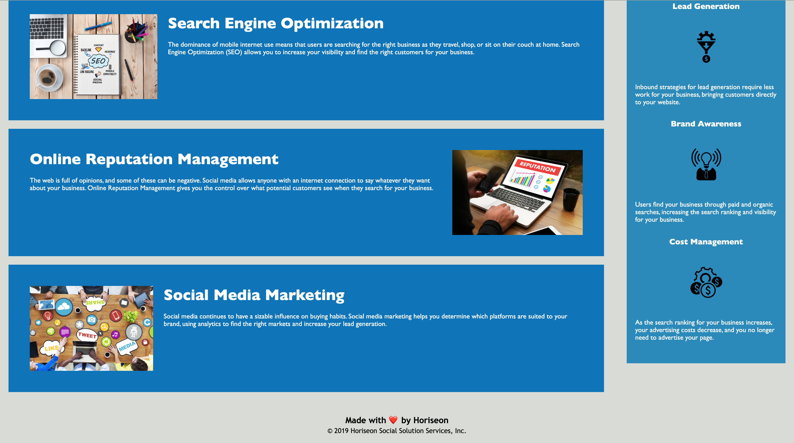

# Code Refactor

In this project, a marketing agency needed assistance with their website that meets the accessibility standards by adding semantic elements and having an orderly structured code so that the website would be optimized for search engines. 

This project serves as a good reminder that we would want websites to be accessible for everyone and to develop best practices when writing code.

## Technologies Used

* [HTML](https://developer.mozilla.org/en-US/docs/Web/HTML)
* [CSS](https://developer.mozilla.org/en-US/docs/Web/CSS)

## Images of Project

Attached below are screenshots in their screen sizes 400px, 768px, and 992px, respectively.

## Deployed Link

* [See Live Site](https://janessaref.github.io/Refactor/)

## Authors

* **Janessa Reeanne Fong** 

- [Link to Portfolio Site](#)
- [Link to Github](https://github.com/janessaref)
- [Link to LinkedIn](https://www.linkedin.com/in/janessafong)

